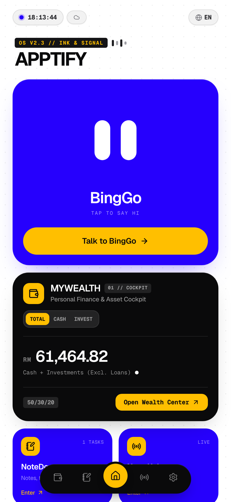
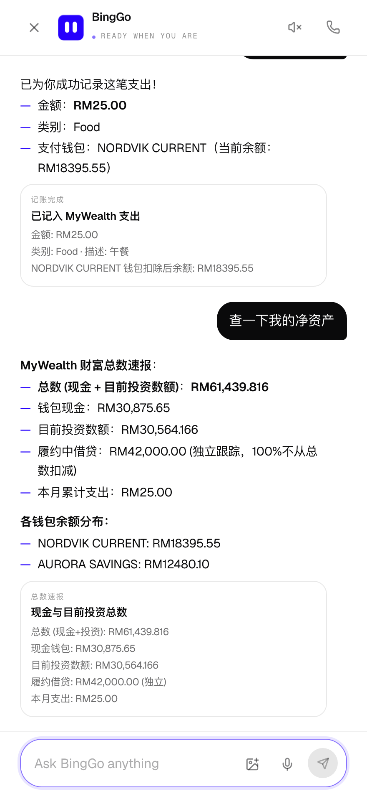
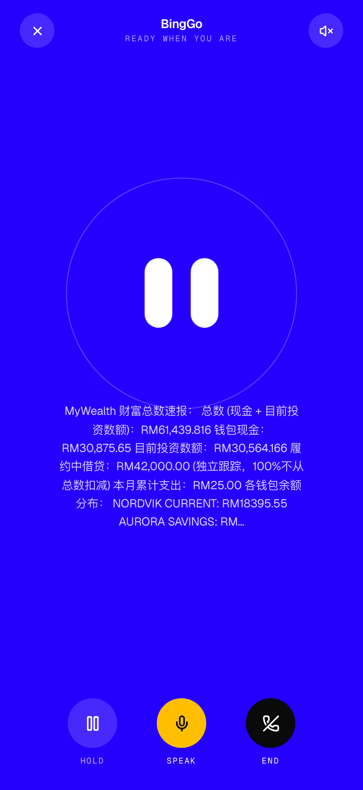
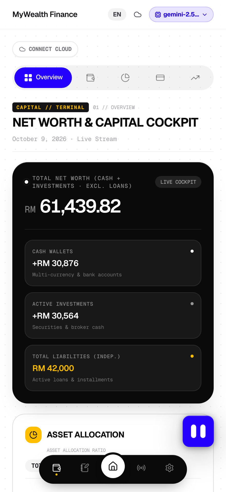
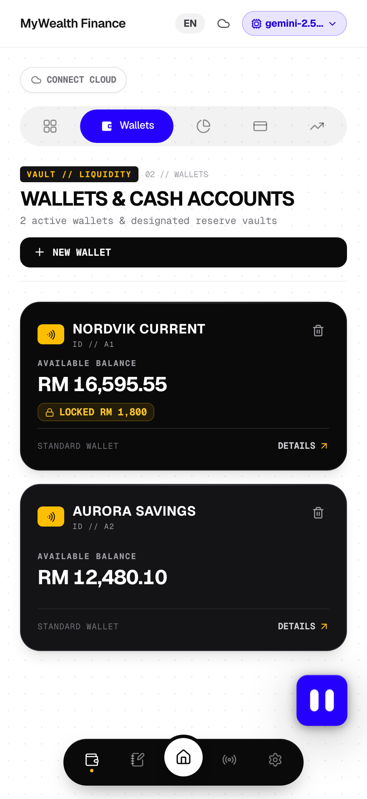
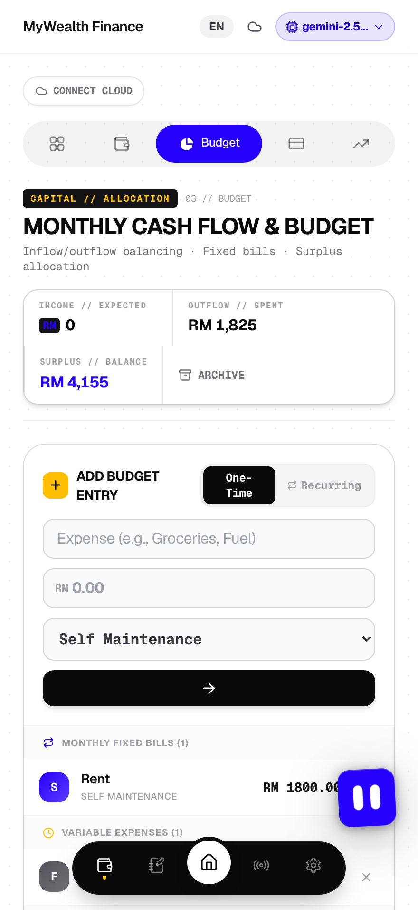
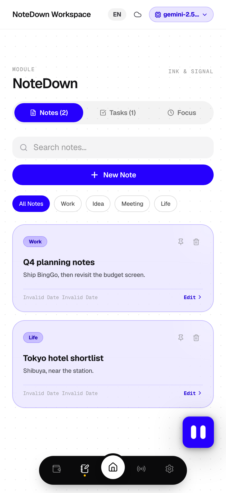
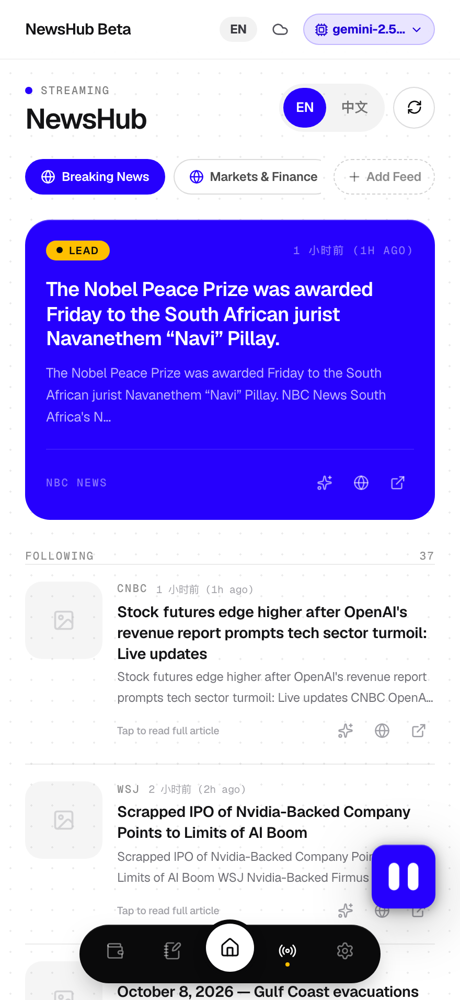
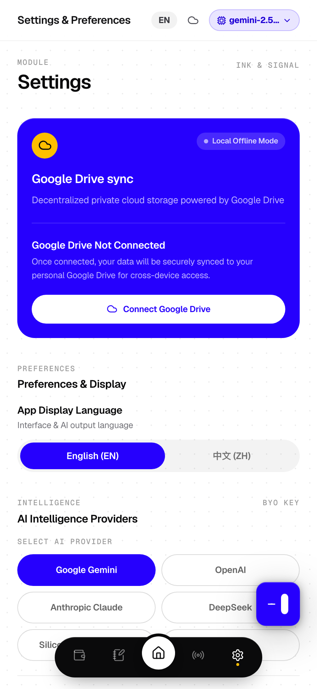

<div align="center">


# APPTIFY

**A Privacy-First Personal Finance OS & Productivity Cockpit**  
*一款以隐私为核心的个人资产管理中枢与生产力工作台*

[](https://react.dev/)
[](https://www.typescriptlang.org/)
[](https://vitejs.dev/)
[](https://tailwindcss.com/)
[](./CHANGELOG.md)
[-4285F4.svg?logo=google-drive)](https://www.google.com/drive/)
[](LICENSE)

<br/>

[English](#english) • [简体中文](#简体中文) • [Changelog](./CHANGELOG.md)

</div>

---

## 📱 Interface Preview / 产品界面预览

<div align="center">
  <table>
    <tr>
      <th align="center"><b>01. Cockpit — BingGo</b></th>
      <th align="center"><b>02. BingGo — Conversation</b></th>
      <th align="center"><b>03. BingGo — Voice Session</b></th>
    </tr>
    <tr>
      <td align="center"></td>
      <td align="center"></td>
      <td align="center"></td>
    </tr>
    <tr>
      <th align="center"><b>04. Net Worth 资产大盘</b></th>
      <th align="center"><b>05. Wallets 账户流水</b></th>
      <th align="center"><b>06. Budget 预算平衡</b></th>
    </tr>
    <tr>
      <td align="center"></td>
      <td align="center"></td>
      <td align="center"></td>
    </tr>
    <tr>
      <th align="center"><b>07. NoteDown 笔记待办</b></th>
      <th align="center"><b>08. NewsHub 实时资讯</b></th>
      <th align="center"><b>09. Settings 设置</b></th>
    </tr>
    <tr>
      <td align="center"></td>
      <td align="center"></td>
      <td align="center"></td>
    </tr>
  </table>
</div>

---

<a name="english"></a>
## 🌟 Overview

**Apptify** is an all-in-one personal finance operating system and productivity cockpit designed with the **"Ink & Signal"** editorial visual aesthetic, with **BingGo** — a resident assistant that can actually operate the app on your behalf — living in every screen.

Unlike traditional personal finance trackers that rely on centralized databases to harvest and store sensitive user accounts, Apptify adopts a **BYOS (Bring Your Own Storage)** architecture: your financial ledgers and notes are saved directly and exclusively to your personal **Google Drive** (`Apptify_Cloud_Data.json`). No centralized database, no server tracking, 100% private.

---

## ✨ Key Features

### 💼 1. MyWealth — Comprehensive Wealth Management
* **Multi-Account Tracking**: Easily manage liquid savings, cash, credit cards, and investment accounts. Real-time balance calculations with transaction history (IN / OUT).
* **Smart Reservations**: Allocate earmarked funds ("Reservations") within your accounts to prevent accidental overspending on planned commitments.
* **Monthly Budgeting**: Automated calculations for monthly income vs. fixed/variable expenses, categorized into Family, Living, Maintenance, Loans, and Savings.
* **Loan Amortization**: Track principal, monthly payments, remaining installments, and payoffs for car loans, mortgages, and personal loans.
* **Portfolio & Cash Reserves**: Monitor multi-currency cash holdings (MYR, USD, HKD) and track stock holdings with profit/loss metrics.
* **AI Valuation Modeling**: Built-in institutional valuation tools including DCF (Discounted Cash Flow), Price-to-Sales, and 5-Year Future Earnings forecasting under conservative and optimistic scenarios.

### 🧠 2. BingGo — The Resident Assistant
* **It acts on your data, not just talks about it.** BingGo can move money between wallets, log expenses, record income, add loans and repayments, add budget lines, write and search notes, create, complete and delete tasks, and navigate the app. Every write is confirmed before it touches your records.
* **A face, not an icon.** BingGo is a blue rounded square with two pill eyes, rebuilt as live DOM rather than an image so it can actually emote: blink at random intervals, glance around, look up, double-blink, wink, tilt, and squash. It is pettable — tap it and it is pleased.
* **Voice in and out.** Speak to it and it answers aloud, using the browser's native speech APIs. No extra key, no extra service. On a browser without them it degrades quietly instead of breaking.
* **It remembers.** Conversations persist across reloads, recall earlier context semantically by embedding similarity, and sync with your Google Drive alongside everything else.
* **Sees images.** Attach a photo and ask about it; replies come back through the same multimodal path the rest of the app uses.
* **Bilingual throughout.** English and Chinese, and it answers in whichever you are using.
* **BYOK (Bring Your Own Key)**, with no server lock-in:
  * Google Gemini (Gemini 2.5 Flash / Pro)
  * DeepSeek (DeepSeek V3 / R1)
  * OpenAI (GPT-4o / o1 / o3-mini)
  * Anthropic Claude (Claude 3.5 Sonnet)
  * SiliconFlow & OpenRouter
* **Local key storage.** API keys live in your browser's private local storage and are never uploaded to an intermediary.

### 📝 3. NoteDown (KnowledgeVault) — Minimalist Productivity
* **Quick Notes**: Clean editorial notes with instant tagging (`Work`, `Idea`, `Meeting`, `Life`), pinning, and search.
* **Task Manager**: Organize tasks with priorities (`High`, `Medium`, `Low`), due dates, and completion status.
* **Focus Timer**: Built-in Pomodoro-style focus timer to maintain deep work states without switching apps.

### 📰 4. NewsHub & InvestSkills — Market Intel & Reports
* **Live News Ticker**: Seamlessly curates real-time financial headlines and RSS market feeds.
* **24+ Wall Street Investment Skills**: Pre-loaded institutional analysis prompt templates (Options Flow, Earnings Call Analysis, DCF Valuation, Competitor Analysis, Insider Trading, etc.) for generating formatted research reports.

### 🔒 5. 100% Private Cloud Sync (Google Drive BYOS)
* **Zero Database Collection**: All records are synced directly to your Google Drive via Google Identity Services (GIS).
* **Multi-Device Sync**: Works effortlessly across your Mac, PC, iPad, and iPhone.
* **Offline / Guest Mode**: Fully functional offline as a local web app without signing in.

### 🎨 6. "Ink & Signal" Visual Design
* Minimalist palette inspired by high-end typography and Swiss print aesthetics:
  * **Brand Blue** (`#2600FD`) • **Ink Black** (`#0A0A0B`) • **Signal Amber** (`#FFBF00`) • **Canvas White** (`#FFFFFF`)
* Tactile paper grain overlay, Geist / Geist Mono typography, and micro-interactions.

---

<a name="简体中文"></a>
## 🇨🇳 中文功能介绍

**Apptify** 是一款兼具现代极简美学与顶级隐私保护的个人资产管理中枢与生产力工作台，并内置常驻 AI 助理 **BingGo**——它不只是聊天，而是能真正替你操作这个 App。

### 核心亮点
1. **100% 绝对隐私 (BYOS 私有云架构)**：
   * 彻底摒弃传统记账软件收集用户数据的中心化数据库。
   * 独创 **BYOS（Bring Your Own Storage）** 模式，所有账本、资产明细与个人笔记直接加密存储在用户个人的 **Google 云端硬盘** (`Apptify_Cloud_Data.json`)。
   * 支持全平台（电脑、平板、手机）跨端实时漫游，亦可完全离线在本地使用。
2. **全维度资产管理 (MyWealth)**：
   * **账户流水**：支持活期储蓄、信用卡、现金、投资等多种账户类型，明细流水清晰记录。
   * **专款预留金 (Reservations)**：为指定目标冻结专款，防止误花透支。
   * **自动预算看板**：自动计算月度收支、储蓄率与各项支出占比（家庭、生活、贷款等）。
   * **贷款分期追踪**：房贷、车贷、个人贷款本金与月供摊销实时演算。
   * **股票持仓与多币种**：支持 MYR、USD、HKD 多币种现金储备与股票持仓盈亏分析。
   * **AI 估值模型**：内置 DCF 自由现金流折现、市销率（P/S）模型与 5 年盈利估值演算。
3. **常驻 AI 助理 (BingGo)**：
   * **真的会动手，不只是聊天**：在钱包间转账、记账、记录收入、添加贷款与还款、添加固定支出、写笔记与搜索笔记、建待办／完成／删除待办、跳转页面。**每一次写入都先经你确认**，不会擅自改动账本。
   * **有形象，不是一个图标**：蓝色圆角方块 + 两只白色椭圆眼睛，**用 DOM 重绘而非贴图**，所以能真正做表情——随机眨眼、左右看、抬头、连眨、单眼眨、歪头、挤压弹跳。**可以点它「摸摸头」**，它会高兴。
   * **能说也能听**：用浏览器原生语音接口说话与收音，**不需要额外密钥、不经过第三方服务**；浏览器不支持时安静降级而不是崩溃。
   * **有记忆**：对话刷新不丢，用向量相似度召回早期上下文，并随 Google Drive 一起跨设备同步。
   * **能看图**：附上图片直接问它。
   * **中英双语**，你用哪种它就答哪种。
   * 支持 **BYOK (自备 API Key)**，自由接入 **Google Gemini、DeepSeek、OpenAI、Claude、SiliconFlow、OpenRouter**，密钥只存在你本地浏览器。

4. **灵感与任务中枢 (NoteDown)**：
   * 随手速记笔记、标签归类、关键词搜索与置顶。
   * 待办事项管理（支持高/中/低优先级与到期日提醒）。
   * 内置专注时钟（Focus Timer），陪伴深度工作。
5. **实时资讯与研报生成 (NewsHub & InvestSkills)**：
   * 实时财经新闻流动条与 RSS 资讯。
   * 预置 24 套华尔街投资分析 Prompt 库（期权异动分析、财报解读、同行对比、催化剂日历等），一键输出专业级股票分析报告。

---

## 🛠️ Tech Stack / 技术栈

* **Frontend**: React 19, TypeScript, Vite 6, Tailwind CSS, Lucide React, Recharts
* **Backend / BFF**: Node.js, Express (Vite Middleware, SSRF 防御, 财经 API 代理)
* **Cloud Storage**: Google Identity Services (GIS OAuth 2.0), Google Drive REST API
* **AI Integration**: Google GenAI SDK, DeepSeek, OpenAI, Anthropic Claude, OpenRouter
* **Typography**: Geist Sans & Geist Mono

---

## 🚀 Getting Started / 快速上手

### Prerequisites / 环境要求
* [Node.js](https://nodejs.org/) (v18.0.0 or later)
* npm (v9.0.0 or later)

### Installation / 安装步骤

1. **Clone the repository / 克隆仓库**
   ```bash
   git clone https://github.com/Rickleong9508/Apptify_V2o3.git
   cd Apptify_V2o3
   ```

2. **Install dependencies / 安装依赖**
   ```bash
   npm install
   ```

3. **Configure Environment (Optional) / 配置环境变量（可选）**
   复制 `.env.example` 为 `.env`：
   ```bash
   cp .env.example .env
   ```
   *如需预设 Google Drive OAuth 登录，可在 `.env` 中填入 `VITE_GOOGLE_CLIENT_ID`（亦可直接在网页端设置中手动填写）。*

4. **Run development server / 启动开发环境**
   ```bash
   npm run dev
   ```
   打开浏览器访问：`http://localhost:3001` (或 `http://localhost:3000`)。

5. **Build for production / 生产编译**
   ```bash
   npm run build
   ```

---

## 🔒 Security & Privacy / 安全与隐私说明

* **零中心化数据库**：Apptify 不部署任何收集用户数据的数据库，用户的所有财务凭据与账本均留存在个人 Google Drive 中。
* **本地凭据隔离**：所有配置的 AI 密钥及 OAuth Token 均安全保存在浏览器本地，不经服务端中转。
* **SSRF 防御加固**：服务端内置严格的内网与本地环回拦截机制，杜绝未授权探测。
* **CORS 严格规范**：遵循 W3C 跨域规范，确保安全访问。

---

## 📄 License

Distributed under the MIT License. See `LICENSE` for more information.
